# Analyzing Music Genres

Spotify is a music streaming application that creates several playlists. One of the playlists that they create is called the "All out" series, where each decade of music is represented by a curated playlist. For example, the playlist 'All out 50s' contains music from that decade that Spotify's algorithm curated. It is supposed to represent the essence of each decade. Note that we are making a huge assumption here trusting that this algorithm has judged the essence of each decade successfully. However, since we have no other better avenue to approach this question, we shall proceed through this route.

## Data
Using the Spotify API, we collected data from the 1950s, the 1960s, the 1970s, the 1980s, the 1990s, the 2000s, and the 2010s. The data collected can be found in the **data** folder. Each CSV file represents a different decade. Every decade contains every song from the aforementioned playlist. Each song is analyzed by several features that we will use to help define the decade. These features are: 

    - top genre: the genre of the song
    - year: year of the song (the year does not correspond with the release year of the original song usually because of re-releases. this is especially true for older music)
    - bpm: beats per minute
    - nrgy: energy of a song (the higher the value, the more energetic)
    - dB: loudness in dB (the higher the value, the louder the song)
    - live: liveness (the higher the value, the more likely that the song is a live recording)
    - val: valence (the higher the song, the more positive mood for the song)
    - dur: duration
    - acous: acousticness (the higher the value, the more acoustic the song is)
    - spch: speechniess (the higher the value, the more spoken word the song contains)
    - pop: popularity (the higher the value, the more popular the song)

These are all really interesting and fundamental aspects of the music. The features that we shall pay most interest in looking at is bpm, val, acous, and spch. 

## Methods and Results
First, in order to understand how each of the decades are represented, we drew a simple correlation matrix. This allows us to understand the relationship that each feature has with every other feature; this could help us determine how we want to go about the model itself. However, we mostly approach this during preliminary exploration. Here, you can see the heatmap drawn of the 1950s dataset. 

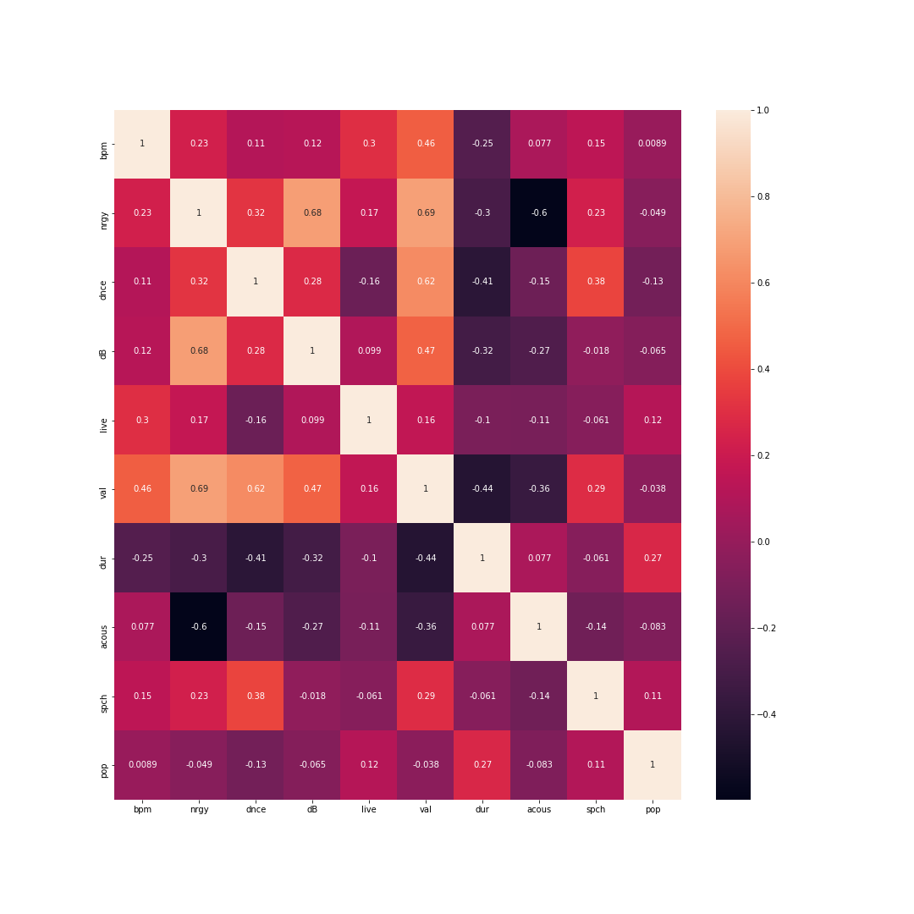

There is not much to note here other than the fact that there are slightly significant correlations with the feature **duration** amongst other features. Valence is also quite notable. It has a significant correlation with the other features as well. This is consistent with the other heatmaps amongst other decades. 

We also analyzed the most popular artists by decade.  Unsurprisingly, the popularity index is consistent throughout the decades. This is probably because each of the playlists only contains the most popular song of each decade. Nonetheless, the data was interesting to look at. 

What we want to understand is how each feature is represented throughout the decades. In other words, how have the features changed and how have they stayed the same. In order to do so, we created a massive dataset including all of these decades and summed each feature up by each decade. 

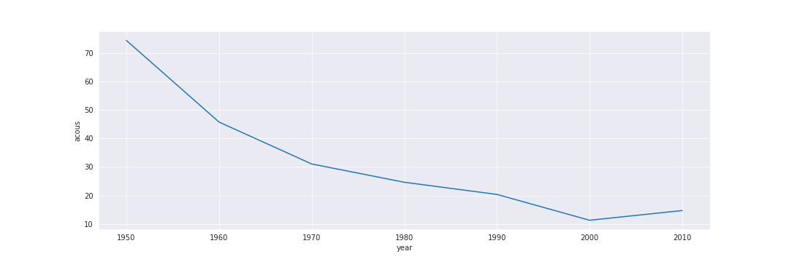
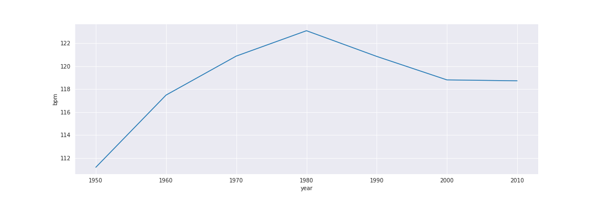
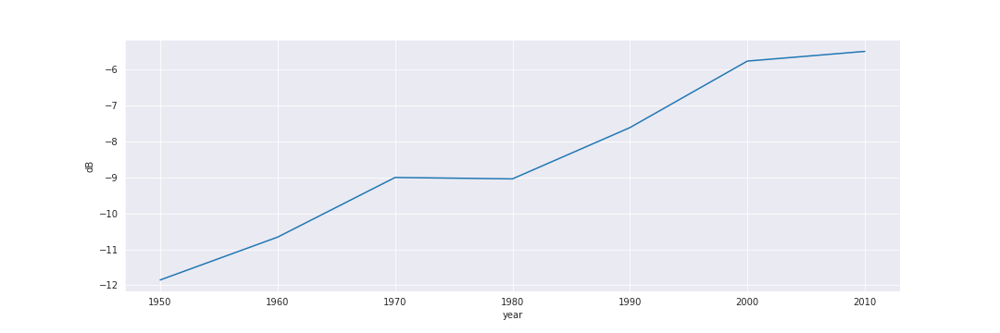
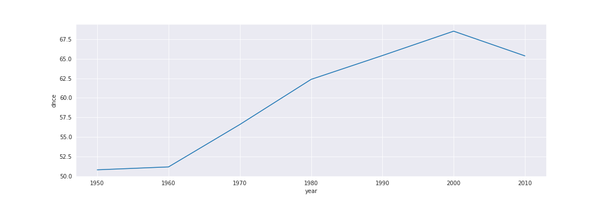
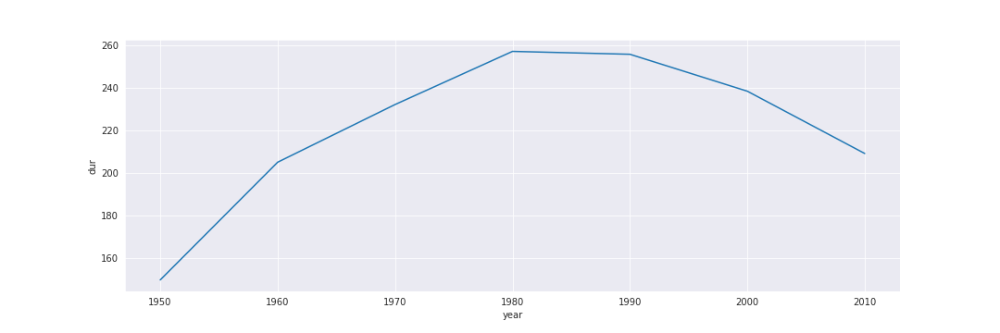
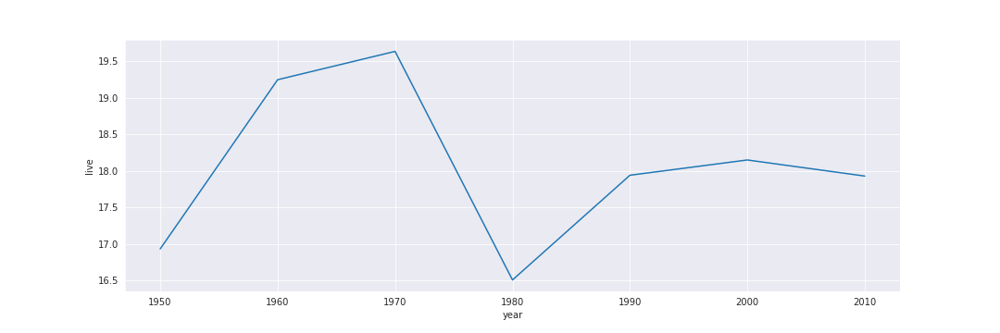
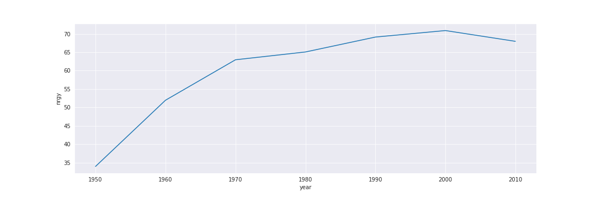
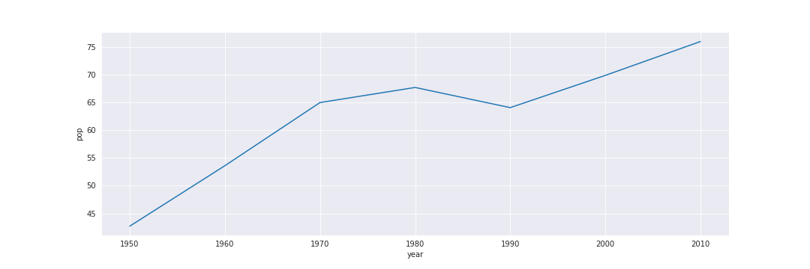
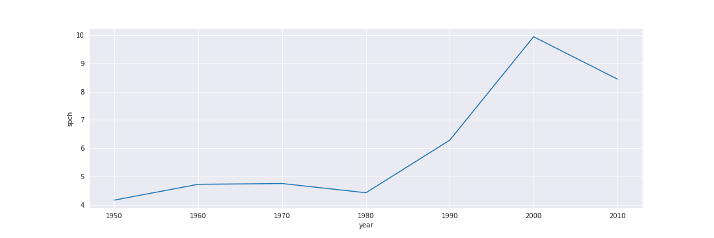
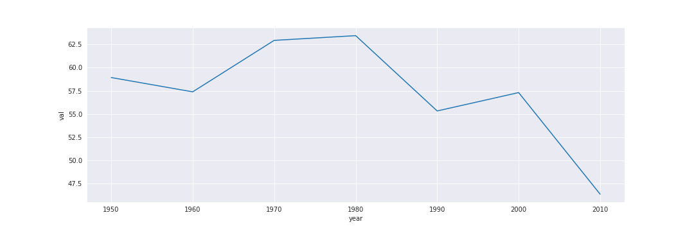

As you can see, the data displays how different each decade acts with every single feature. Each feature also has dramatically different relationships with time. While decibels seems to increase slowly over a period of time, probably reflecting the improving recording equipment, valence has a very staggering relationship. It seems to increase, but then it rapidly decreases.

## Random Forest Regressor

The last thing we attempted was to create a Random Forest based simulation in order to mathematically understand how we could classify each decade. In order to do this, we split the datasets. X would contain all of the features other than year (which we recomputed) and y would contain the year. After training the model on this split data, we predicted it on a small set of data.

An interesting facet of ensemble learning models is how they are able to extract the feature importances and 'decisions' the models actually make on a mathematical level. By doing this, we can really understand the thresholds between what makes music part of the '2000s' or the '2010s.'

It is important to note that this is not a definitive algorithm. There are several assumptions we are making, including that the Random Forest Regressor was trained well in first place. While it only ever reached 60 percent accuracy, we only removed the feature importances after training on the whole dataset. So, despite having a dev accuracy of 60 percent, we are hoping that training on the entire model would have helped the accuracy increase by at least 10 percent. This is another assumption we are making.

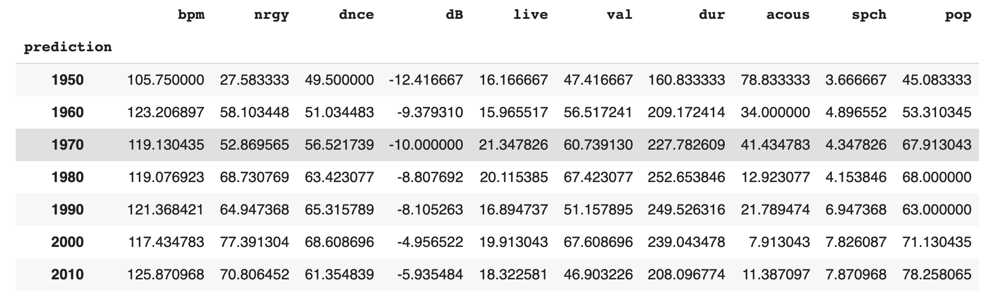

### Interpretations

It is safe to assume that our first belief that music trends would operate strictly cyclically was incorrect. Music trends seem to operate too staggeringly to make bold statements like that. For example, while some aspects of music seem to continue on a linear trend, some do operate on a more 'cyclical' or seasonal basis. For example, while Energy seems to grow linearly, Valence staggers cyclically. 

Acoustics decreased significantly within the last few decades. This is probably because in the last few decades, especially in the 2000s and the 2010s, we have seen a sharp increase in Electronic and EDM music. Beats per minute (BPM) increased for a long time, reaching their peek in 1980. However, since, BPM have slumped down. As I mentioned before, however, 80s music has seen a recent aesthetic return, and the small increase towards 2010s could be a nudge to that. However, without more recent data, we cannot say for sure. 

dB, Energy, Popularity, and Liveness are probably largely caused by the growth of recent technology, including Spotify itself. The increase in decibels is most likely due to the improving quality of recording equipment, like we mentioned before. Liveness is probably due to the fact that more recent recording artists are able to release their live albums (something that was not possible before). 

Duration, Speechiness, Valence are probably the three graphs we are most interested in looking further into. Speechiness reflects the amount of words that are in a song. The decreasing speechiness, combined with the increasing danceability, seems to point towards Electronic music. Valence is another interesting graph; it reflects the positive moods of music. Valence did reach its peak in the 1970s and 1980s, which in our subjective experience, sounds correct. Recent popular music, in the 2000s and 2010s, are much more introspective and sadder.

## Future Analysis
This was an interesting experiment to see how music has changed over the past several decades. Although our initial interpretation of the music industry was clearly proven incorrect,  it was interesting to see how and where that interpretation came to be. 

In future experiments, we would like to take a further look into Valence and what makes a happy/sad song. Is it possible to detect emotion in a song through these features? 

